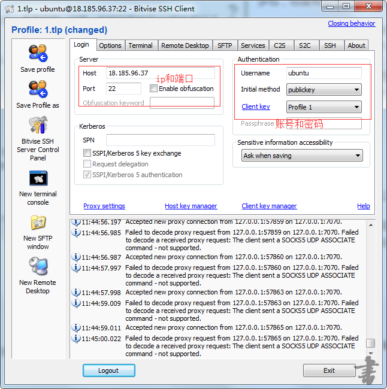
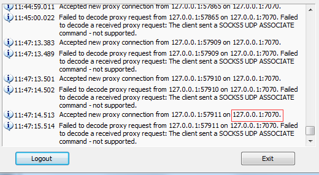
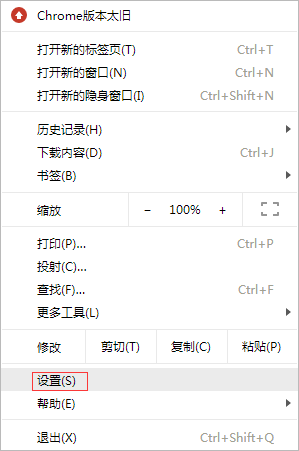
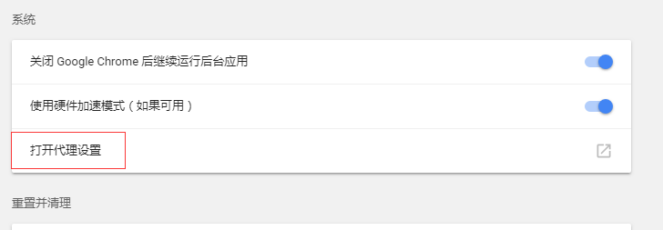
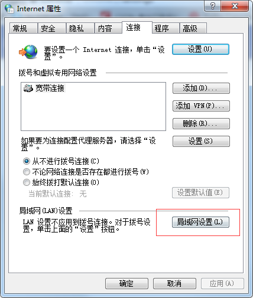
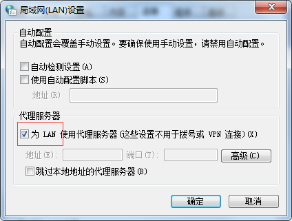
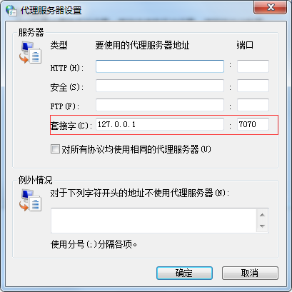
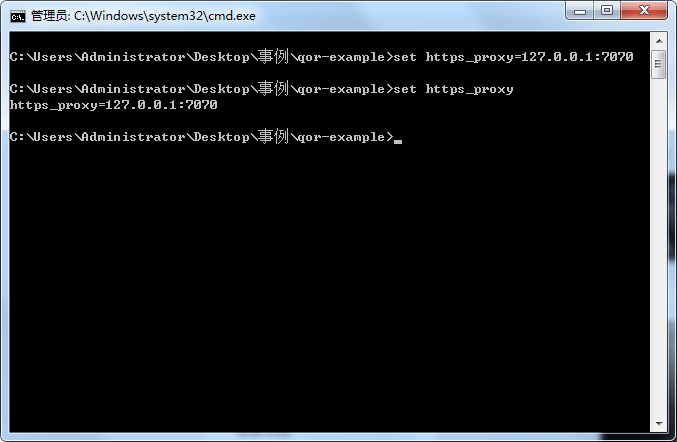
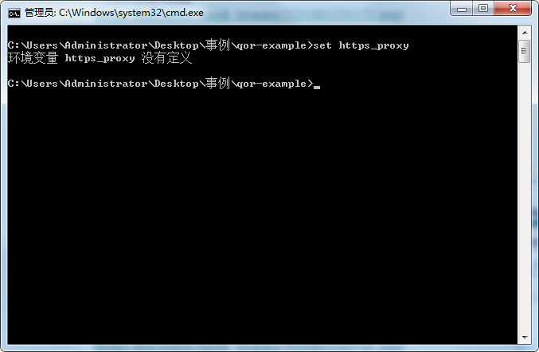

在开发的慢慢长路中，我们经常遇到以下问题，比如我遇到的，开发react的时候用到谷歌的扩展工具Redux DevTools，但是天朝不给你下啊，你没办法，必须翻墙。还有在开发go的时候用到很多包，但是有些包也是你大天朝下不了的，这又要翻墙。

我一个开发人员一边要解决开发的问题，一边还要为这些小事情烦恼。当然，有钱的直接买vpn软件就好了，也不用看我接下来说的。

于是在同时担当linux运维的时候（苦逼的程序员，前端、后台加linux运维），了解到ssh的另一个最有用的功能，远程连接什么的和这个比实在是小功能。

# 需要的工具
1.Bitvise SSH Client，可以去[Bitvise SSH Client](https://bitvise-ssh-client.updatestar.com/)网站下载

2.一个国外服务器，一般有国外项目的公司都会有的，不过你如果不是大佬和运维，也一般拿不到。也可以自己买一个，也不贵，至少能又做开发又能翻墙看点学习资料。

# 开始翻墙
打开Bitvise SSH Client，输入ip端口账户密码，点击最下面的登录。

登录成功后会显示

172.0.0.1:7070就是你代理的ip和端口

到这一步，代理算弄好了，但是，你打开浏览器发现还是打不开国外的网站。那是因为你没有通知浏览器。

# 通知程序
我用的是谷歌浏览器

1.打开谷歌的设置

2.选择代理

3.选择局域网配置

4.勾起lan

5.点开高级，配置ip和端口

这样，我们就可以用谷歌翻墙了

​

但是，我如果还想要下载国外的包呢，在开发的时候，比如我现在要下载go的包。

我们可以这样做，打开cmd

这样我们也能够翻墙了，不过这是在当前窗口生效

# 最后
如果觉得对你有帮助，可以打赏一下（加个备注），为我的服务器续点时间吧。

